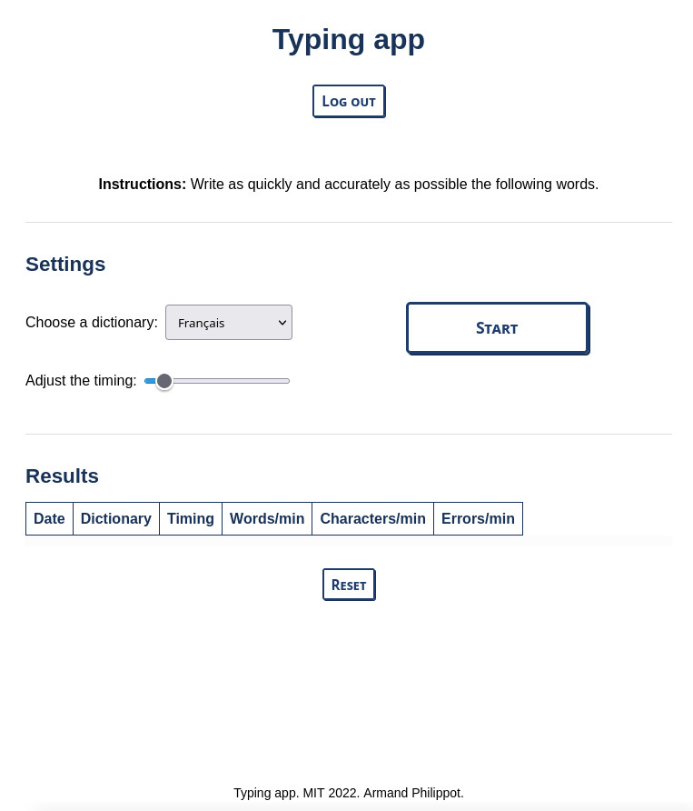

# Vue Typing App

A typing app implementation with Vue.

## Requirements

- Yarn

## How to

### Start the development version

`yarn && yarn run serve`

### Start the build version:

1. `yarn && yarn run build`
2. (`yarn global add serve`)
3. `serve -s dist`

## Preview

You can see a live preview here: https://demo.armandphilippot.com/#typing

## License

This project is open source and available under the [MIT license](../LICENSE).
